# Simulator 2.0.2 SE Patch
- **CLEAN LOGS**. you only see what you expect to see `console.log("my log")`  becomes  `12:12:12.120 > my log`
- **AUTOMATIC LOG SCROLL** to show latest content (auto disabled when you manually scroll up; reenabled when scrolled down)
- automatically converts emulator timestamps from UTC to user's local timezone (no more random timestamps in your logs)
- re/writes noisy logs under the `simulator/` folder inside a `sim-debug.log` file (in case you still need to see them!)
- seamlessly handles `logger.warn("my log")` as `12:12:12.120 > WARN > AppName > my log` (in yellow text)
- small bugfixes like random `undefined` at the end of each `logger.error(...)`
- colored logs in logger/vis for info/error/warn/debug methods are preserved

the solution isn't perfect but it should remove at least **90%** of the garbage that emulators produce.

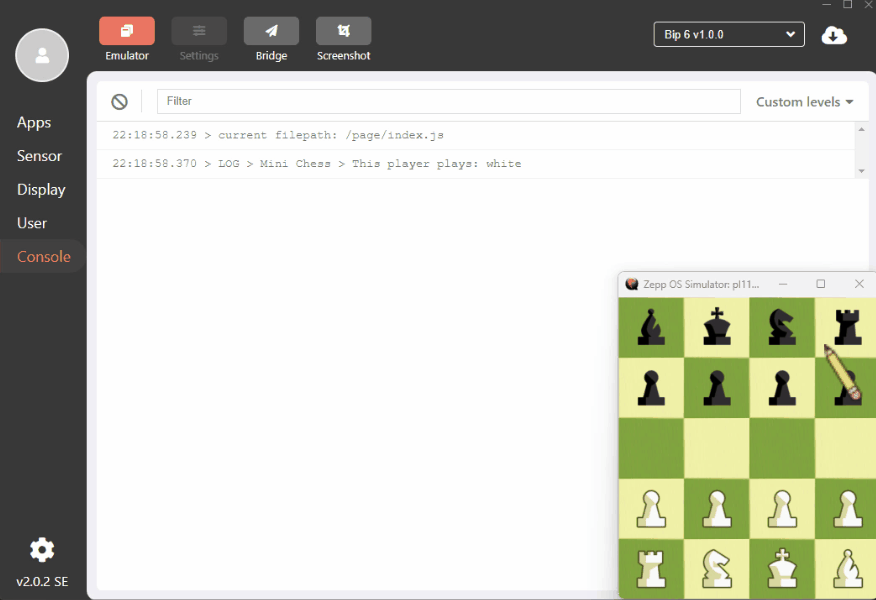

To patch your Simulator 2.0.2:
1. Make sure you have the `2.0.2` version or get it from here https://docs.zepp.com/docs/guides/tools/simulator/download/
2. Close the `Simulator` if already running
3. Unzip the contents of one of the archives from the [Releases](../../releases) page into where the `simulator/` is installed (ie next to simulator.exe if you're on Windows)
   - sim_202_se_patcher & apply.patch should be located next to the sim
   - you can also see the `sim-debug.log` file here, which will contain all the logs `untouched`
   - `(!)` on linux make sure to execute `chmod +x sim_202_se_patcher` before running it

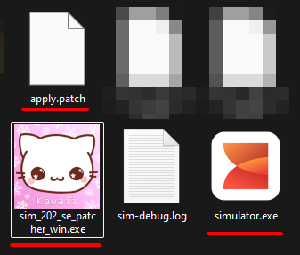

4. Run the patcher, and if everything goes OK, start the simulator again

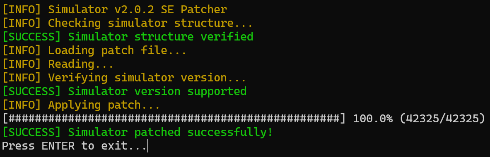

5. Observe the version change from `2.0.2` to `2.0.2 SE`
5. Enjoy!

## Before
- garbage

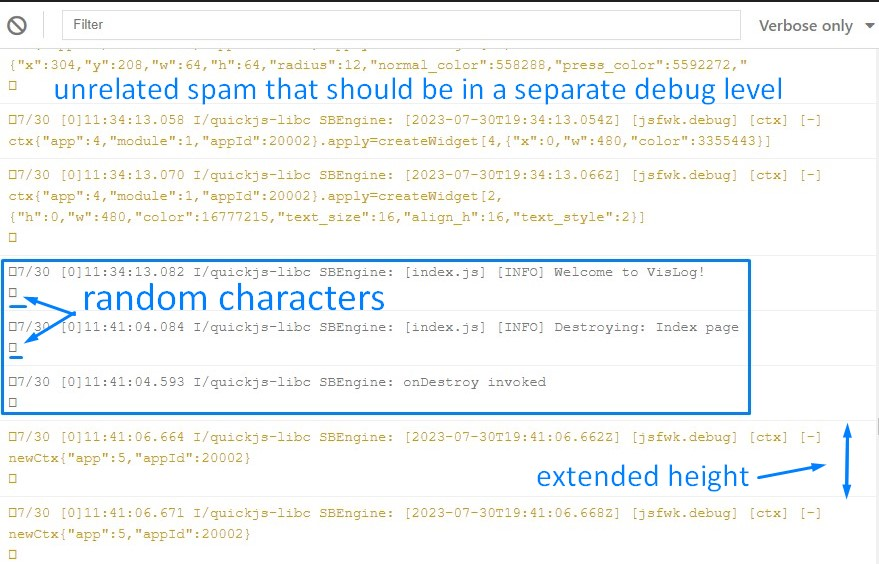

## After
- clean logs

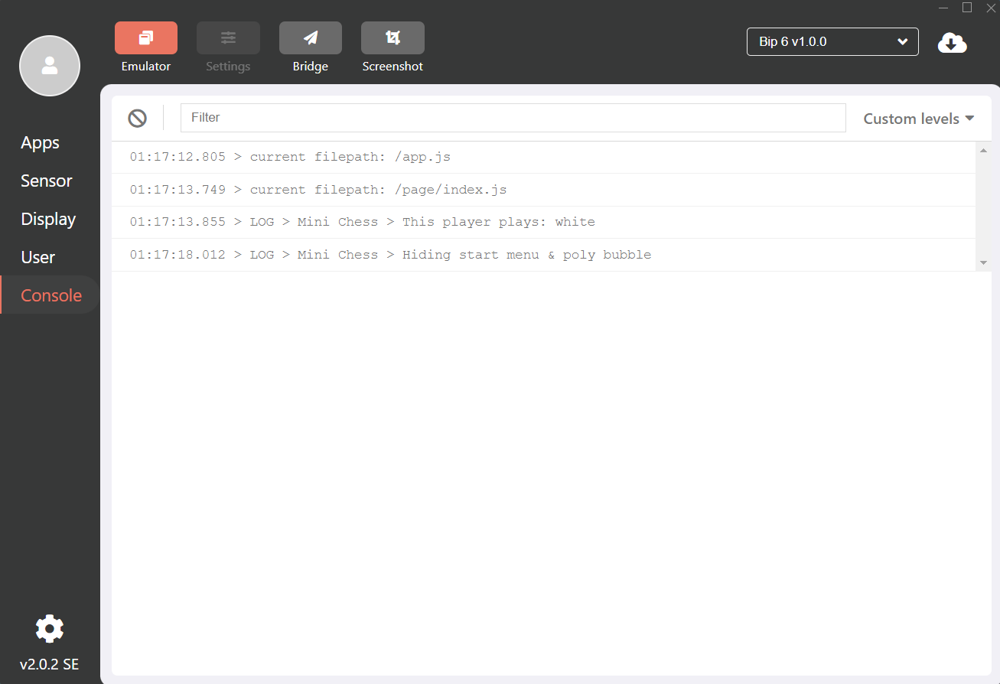

# ACRHIVE

Click to expand

# Simulator 2.x SE

This is an alpha release of the `Simulator 2.x`. You can wait for its full release soon or start testing now. Below are the installation instructions for Windows, Linux, and macOS platforms.

The `Simulator 2.x` has these crucial benefits:
1. Does NOT require `sudo` or other administrative privileges
2. Does NOT require a `TUN/TAP` adapter which inherently solves these issues
    - Some VPNs are known to overwrite our `tun` adapter. When that happens the simulator stops working. It can be impossible to figure out the issue.
    - Other VPNs that block LAN visibility firewall the `tun` adapter making it impossible to reach the Emulator
    - The number of supported platforms can be extended now. This should bring our Simulator to more `ARM` based devices and other architectures

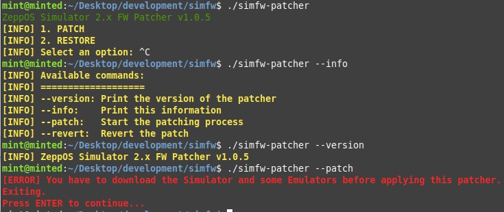

In the future, our `firmware patcher` will be integrated into the Simulator for more seamless interaction.

## Table of Contents

- [How to Install on Windows](#how-to-install-on-windows)
- [How to Install on Linux](#how-to-install-on-linux)
- [How to Install on macOS](#how-to-install-on-macos)

## How to Install on Windows

To install Simulator 2.x on Windows:
1. Download and install the current version of Simulator from [our website](https://upload-cdn.huami.com/zeppos/simulator/download/simulator_1.2.4.exe)  
   (you can skip this step if you already have it installed)
2. Unzip the contents of one of the archives from the [Releases](../../releases) page, overwriting the contents.
* by default, on windows, the Simulator is installed under `C:\Users\YOUR_USERNAME\AppData\Local\Programs\`
3. Run the Simulator and install all the necessary Emulators.
4. Finally, run the `simfw-patcher-win.exe` which is located in the same folder as `simulator.exe` and follow the instructions.
5. Done! You should be able to run the Simulator without `TUN/TAP` adapter.

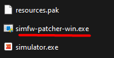

## How to Install on Linux

To install Simulator 2.x on Linux:
1. Download and install the current version of Simulator from [our website](https://upload-cdn.huami.com/zeppos/simulator/download/simulator_1.2.4_amd64.deb)  
   (you can skip this step if you already have it installed)
2. Unzip the contents of one of the archives from the [Releases](../../releases) page, overwriting the contents.
* by default, on linux, the Simulator is installed under `/opt/`
3. Run the Simulator and install all the necessary Emulators.
4. Finally, run the `simfw-patcher-linux` which is located in the same folder as `simulator`'s executable and follow the instructions.
* you might have to make pather executable with `chmod +x simfw-patcher-linux`
5. Done! You should be able to run the Simulator without `sudo` and without `TUN/TAP` adapter.

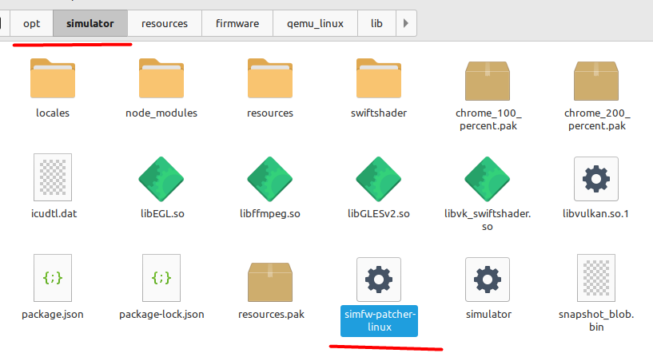

## How to Install on macOS

To install Simulator 2.x on macOS:
1. Download and install the current version of Simulator from [our website](https://upload-cdn.huami.com/zeppos/simulator/download/simulator_1.2.4.dmg)  
   (you can skip this step if you already have it installed)
2. Extract the contents of one of the archives from the [Releases](../../releases) page, overwriting the contents.
* by default, on mac, the Simulator is installed under `Applications/simulator`
3. Run the Simulator and install all the necessary Emulators.
4. Finally, run the `simfw-patcher-mac` that is located next to the `Contents` folder and follow the instructions.
5. Done! You should be able to run the Simulator without `sudo` and without `TUN/TAP` adapter.

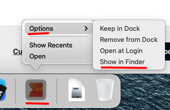  
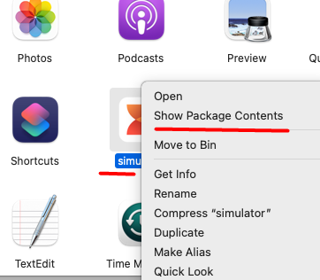  
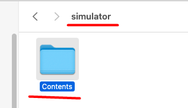  
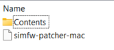

